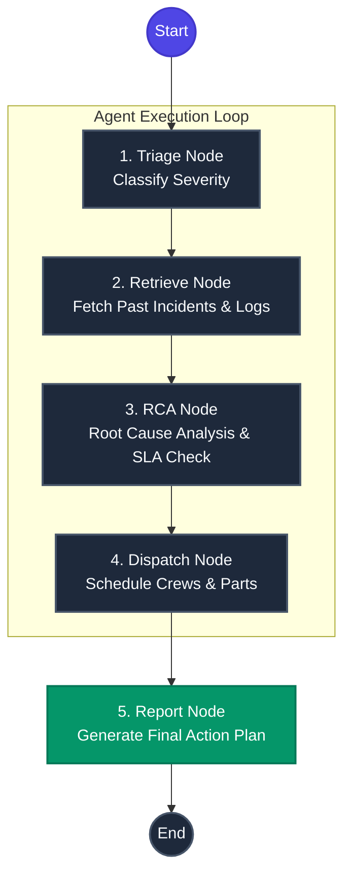

# Telecom Enterprise Agent - Architecture & Technical Documentation

## 1. System Overview

The **Telecom Enterprise Agent** is an AI-powered operations system designed to autonomously perform root cause analysis, dispatch planning, and incident reporting for telecommunications infrastructure.

The architecture consists of two main components:
- **Frontend (React + Vite)**: A responsive, glassmorphism UI built with TailwindCSS that allows NOC operators to visualize incidents and trigger the AI agent.
- **Backend (FastAPI + LangGraph)**: A stateful API that orchestrates the AI reasoning loop to ingest logs, query databases, and generate actionable reports.

## 2. Technical Stack

| Layer | Technologies Used | Purpose |
|---|---|---|
| **Frontend** | React, Vite, TailwindCSS, Lucide-React | Provides the interactive dashboard for the operations team. |
| **Backend API** | FastAPI, Uvicorn, Pydantic | Exposes the `/api/trigger` endpoint to initiate the agent. |
| **Agent Core** | LangGraph, Python 3 | Orchestrates the multi-step reasoning workflow. |
| **Data Layer** | Python Mocks (extensible to SQL/NoSQL) | Simulates maintenance logs, SLA documents, and crew availability. |

## 3. Agentic Workflow (LangGraph)

The AI Agent operates using a deterministic state graph, moving through specific analytical nodes before generating a final report. This ensures reliable and citable outputs rather than unpredictable LLM hallucinations.



### Workflow Nodes Breakdown:
1. **Triage Node**: Ingests the initial incident logs (e.g., voltage drops) and classifies the severity (P0 vs P1).
2. **Retrieve Node**: Queries the database for historical incidents at the specific tower to find patterns.
3. **RCA Node (Root Cause Analysis)**: Analyzes the current symptoms against historical data to predict the root cause (e.g., faulty rectifier) and checks vendor SLAs.
4. **Dispatch Node**: Checks parts inventory and available certified crews to formulate a multi-step resolution plan.
5. **Report Node**: Synthesizes all gathered evidence into a structured markdown report with citations.

## 4. Application Demonstration

Below is a recording of the Telecom Enterprise Agent in action, demonstrating the step-by-step reasoning process triggered by an operator:


## 5. Deployment Setup

To deploy this application to a server (e.g., Vultr Ubuntu instance):

1. **Backend Configuration**:
   ```bash
   cd backend
   python3 -m venv venv
   source venv/bin/activate
   pip install -r requirements.txt
   uvicorn app.main:app --host 0.0.0.0 --port 8000
   ```

2. **Frontend Configuration**:
   The frontend uses environment variables to target the backend.
   ```bash
   cd frontend
   npm install
   VITE_API_URL=http://<YOUR_SERVER_IP>:8000 npm run dev
   ```

3. **Firewall**: Ensure ports `8000` and `5173` are open on both your cloud provider's firewall and internal `ufw`.
