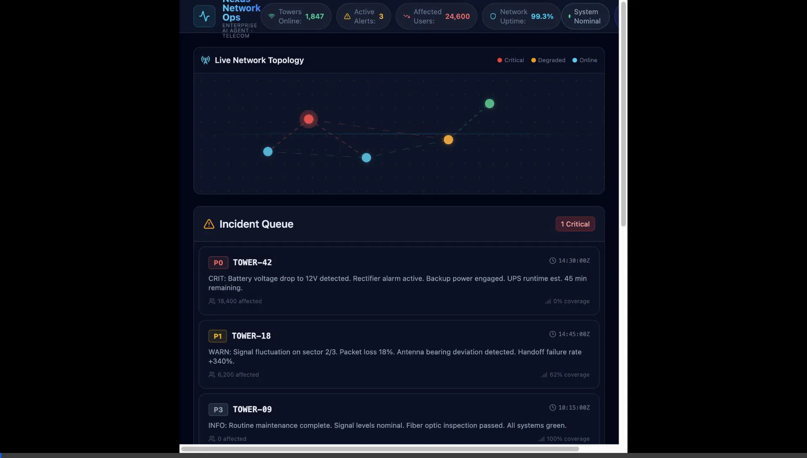
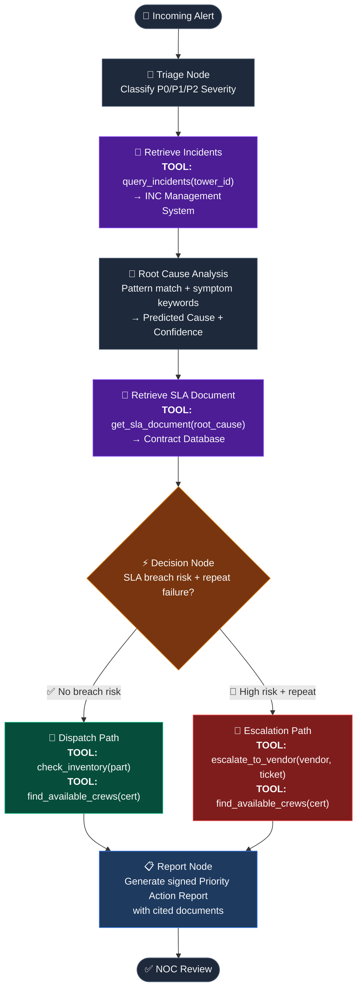

# Nexus Network Ops — Enterprise Telecom AI Agent

## System Overview

The **Nexus Network Ops Agent** is a web-based Enterprise AI agent built for the Telecommunications industry. It demonstrates a true **multi-step agentic workflow**: the agent plans its investigation, retrieves documents multiple times, calls specialized tools, makes branching decisions, and produces a signed Priority Action Report that a real NOC team can act on.

This is **not** a retrieve-then-answer pipeline. Every decision is grounded in cited documents, and the agent can take two different resolution paths depending on what it discovers.

## Application Demo



---

## Agentic Workflow Architecture

The agent is built on **LangGraph** — a stateful, cyclical graph framework. It executes 7 distinct nodes with **conditional branching** after the decision node.



### What makes this a true agent:

| Criterion | Implementation |
|---|---|
| **Plans** | `decision_node` evaluates all evidence and selects one of two paths |
| **Retrieves >1 time** | First retrieval: incident history. Second retrieval: targeted SLA document after RCA |
| **Calls Tools** | 5 named tool calls: `query_incidents`, `get_sla_document`, `check_inventory`, `find_available_crews`, `escalate_to_vendor` |
| **Makes Decisions** | Conditional LangGraph edge branches on inventory + SLA breach risk |
| **Document-grounded** | Every decision cites a specific contract excerpt (e.g., Clause 7.3, Clause 9.1) |
| **Enterprise-usable** | Signed, timestamped Priority Action Report with full audit trail |

---

## Technical Stack

| Layer | Technologies | Purpose |
|---|---|---|
| **Frontend** | React 19, Vite, TailwindCSS 4, Lucide-React | Interactive NOC dashboard with live streaming UI |
| **Streaming** | SSE (Server-Sent Events) via `fetch()` + `ReadableStream` | Real-time node-by-node agent reasoning display |
| **Backend API** | FastAPI, Uvicorn, Pydantic | `/api/stream` SSE endpoint + `/api/trigger` REST |
| **Agent Core** | LangGraph 1.2 | Stateful, branching multi-step workflow |
| **Data Layer** | Structured mock data (IMS, SLA contracts, ERP, WFM) | Simulates real enterprise systems |

---

## API Reference

### `POST /api/stream`
Streams the agent's node-by-node reasoning as Server-Sent Events.

**Request:**
```json
{
  "incident_id": "INC-2026-89",
  "tower_id": "TOWER-42",
  "event_type": "Outage",
  "logs": "Battery voltage drop to 12V detected. Rectifier alarm."
}
```

**SSE Event Types:**
| Event Type | Description |
|---|---|
| `start` | Agent initialized |
| `node_complete` | A LangGraph node finished — includes node name, message, tool calls |
| `complete` | Final state — includes full report, citations, decision |
| `error` | Unhandled exception |

### `POST /api/trigger`
Synchronous endpoint returning the full final state.

### `GET /api/health`
Returns agent version and health status.

---

## Deployment

### Local Development

```bash
# Backend
cd backend
python3 -m venv venv && source venv/bin/activate
pip install -r requirements.txt
uvicorn app.main:app --host 0.0.0.0 --port 8000

# Frontend (in a separate terminal)
cd frontend
npm install
VITE_API_URL=http://localhost:8000 npm run dev
```

### Production Server (Ubuntu/Vultr)

```bash
# Backend
cd ~/telecom_agent/backend
python3 -m venv venv && source venv/bin/activate
pip install -r requirements.txt
nohup uvicorn app.main:app --host 0.0.0.0 --port 8000 > backend.log 2>&1 &

# Frontend
cd ~/telecom_agent/frontend
npm install
nohup npm run dev > frontend.log 2>&1 &
```

**Firewall rules required:** Open TCP ports `8000` (API) and `5173` (Frontend) in your cloud provider firewall and local `ufw`.

---

## Project Structure

```
telecom_agent/
├── backend/
│   ├── requirements.txt          # fastapi, uvicorn, langgraph, sse-starlette
│   └── app/
│       ├── main.py               # FastAPI + SSE streaming endpoint
│       ├── agent/
│       │   └── workflow.py       # LangGraph 7-node branching workflow
│       └── database/
│           └── mock_data.py      # SLA contracts, incidents, inventory, crews
└── frontend/
    ├── vite.config.js
    ├── package.json
    └── src/
        ├── App.jsx               # Main layout + live network stats
        ├── components/
        │   ├── Dashboard.jsx     # SVG network map + incident queue
        │   ├── AgentInterface.jsx # SSE streaming reasoning panel
        │   ├── ToolCallCard.jsx  # Expandable tool call visualization
        │   └── DocumentCitations.jsx # Cited documents panel
        └── index.css
```
