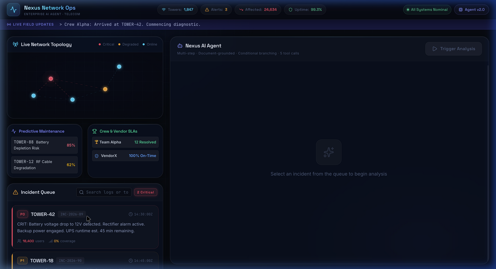
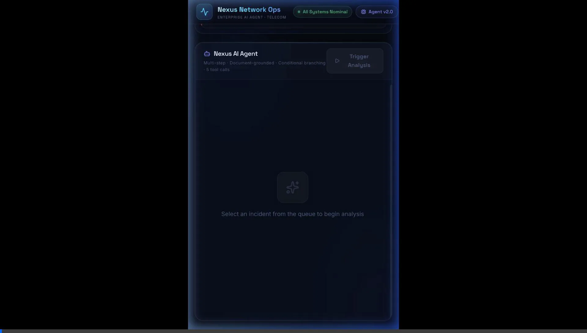
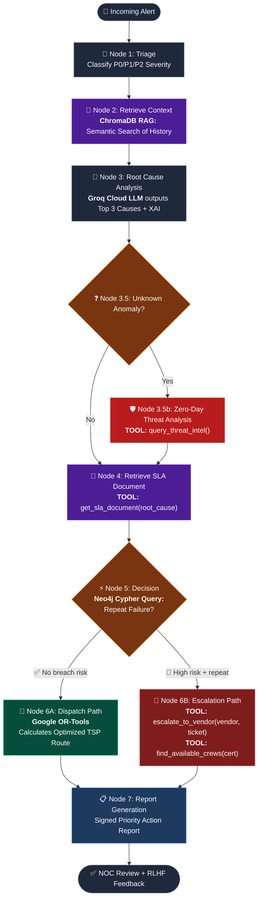

# 🌐 Nexus Network Ops — Enterprise AI Agent 📡🤖
[]()

> A production-grade, AI-driven autonomous agent built for telecommunications Network Operations Centers (NOC). 

 built on LangGraph, FastAPI, and React.

[](https://python.org)
[](https://fastapi.tiangolo.com)
[](https://langchain-ai.github.io/langgraph/)
[](https://react.dev)
[](https://vite.dev)
[](https://tailwindcss.com)

---

## 🧠 What Makes This a True Agent?

## 🎯 The Problem & Solution

### The Problem
Field crews spend days diagnosing outages due to fragmented logs, leading to SLA penalties and inefficient dispatch.

### The Solution: TSLAM-4B Integration
Nexus Network Ops Agent ingests live telemetry, maintenance logs, and vendor SLAs. It leverages the **TSLAM-4B Architecture**—a cloud-based inference pipeline using **Groq LLM API**, a **ChromaDB RAG** for historical incident grounding, and a **Neo4j Knowledge Graph** to map topology. It doesn't just answer questions; it analyzes physical hardware metrics, detects zero-day threats, identifies systemic failures, and uses **Google OR-Tools** to dispatch crews via mathematically optimized geographical routes.

### Live Agent Execution Demo


| Capability | Implementation |
|---|---|
| **TSLAM-4B Driven AI Engine** | Integrates Groq LLM Cloud Inference for 0-latency reasoning without overloading the local Vultr server. |
| **Neo4j Knowledge Graph** | Maps topology and queries historical outage frequency using Cypher to dynamically route escalation logic. |
| **ChromaDB RAG Pipeline** | Contextualizes current incidents by embedding and semantically searching historical outage logs to prevent LLM hallucinations. |
| **Dynamic Dispatch Optimization** | Uses Google OR-Tools to solve the Traveling Salesperson Problem, calculating the mathematically optimal geospatial route for field crews. |
| **RLHF Self-Learning** | Learns from human NOC operators via Approve/Dismiss UI feedback, dynamically adjusting its internal threshold confidence weights. |
| **Real-time streaming** | SSE (Server-Sent Events) streams each node's reasoning live to the frontend |

---

## 🏗️ Architecture

### Agentic Workflow Graph



### System Architecture

```
┌─────────────────────────────────────────────────────────────────┐
│                        FRONTEND (React 19 + Vite)               │
│  ┌──────────────┐  ┌─────────────────┐  ┌───────────────────┐  │
│  │  Dashboard   │  │ AgentInterface  │  │  ToolCallCard     │  │
│  │  SVG Network │  │ SSE Stream      │  │  Expandable       │  │
│  │  Map + Queue │  │ Live Reasoning  │  │  Tool Viz         │  │
│  └──────────────┘  └─────────────────┘  └───────────────────┘  │
│                          SSE / HTTP                              │
└─────────────────────────────────────────────────────────────────┘
                               │
                    POST /api/stream (SSE)
                    POST /api/trigger (REST)
                               │
┌─────────────────────────────────────────────────────────────────┐
│                   BACKEND (FastAPI + Uvicorn)                    │
│  ┌──────────────────────────────────────────────────────────┐   │
│  │                  LangGraph Agent                          │   │
│  │  triage → retrieve_incidents → rca → retrieve_sla        │   │
│  │       → decision ──────────── dispatch → report          │   │
│  │                  └──────────── escalate ┘                │   │
│  └──────────────────────────────────────────────────────────┘   │
│  ┌─────────────────────────────────────────────────────────┐    │
│  │              Mock Enterprise Data Layer                  │    │
│  │  IMS (Incidents) │ SLA Contracts │ Inventory │ WFM      │    │
│  └─────────────────────────────────────────────────────────┘    │
└─────────────────────────────────────────────────────────────────┘
```

---

## 🛠️ Technical Stack

| Layer | Technology | Version | Purpose |
|---|---|---|---|
| **Frontend Framework** | React | 19.x | UI component tree |
| **Frontend Build** | Vite | 8.x | HMR dev server, optimised bundle |
| **UI Styling** | TailwindCSS | 4.x | Utility-first CSS |
| **UI Icons** | Lucide React | 1.x | SVG icon set |
| **Markdown Rendering** | react-markdown | 10.x | Render final action report |
| **HTTP Client** | Axios | 1.x | REST requests |
| **Backend API** | FastAPI | 0.115 | `/api/stream`, `/api/trigger`, `/api/health` |
| **ASGI Server** | Uvicorn | Standard | Production-grade async server |
| **Data Validation** | Pydantic | 2.x | Request/response models |
| **Agent Framework** | LangGraph | 1.2 | Stateful, branching multi-step workflow |
| **Streaming** | SSE (Server-Sent Events) | — | Real-time node-by-node streaming |
| **Data Layer** | Python mock data | — | Simulates IMS, SLA DB, Inventory, WFM |

---

## 📁 Project Structure

```
telecom_agent/
├── README.md                      # ← You are here
├── ARCHITECTURE.md                # Detailed technical architecture doc
├── demo.webp                      # Application demo animation
│
├── backend/
│   ├── requirements.txt           # fastapi, uvicorn, langgraph, pydantic, sse-starlette
│   └── app/
│       ├── main.py                # FastAPI app: SSE streaming endpoint + CORS
│       ├── agent/
│       │   └── workflow.py        # LangGraph 7-node branching StateGraph
│       └── database/
│           └── mock_data.py       # Structured mock: SLA contracts, incidents, inventory, crews
│
└── frontend/
    ├── index.html                 # App shell
    ├── vite.config.js             # Vite config (host: true for network exposure)
    ├── package.json               # Dependencies
    ├── tailwind.config.js         # TailwindCSS config
    ├── postcss.config.js          # PostCSS config
    └── src/
        ├── main.jsx               # React entrypoint
        ├── App.jsx                # Root layout + live network stats panel
        ├── index.css              # Global styles + custom CSS design system
        └── components/
            ├── Dashboard.jsx      # SVG network topology map + incident queue
            ├── AgentInterface.jsx # SSE streaming real-time reasoning panel
            ├── ToolCallCard.jsx   # Expandable tool call visualization card
            └── DocumentCitations.jsx  # Cited documents panel
```

---

## 🚀 Getting Started

### Prerequisites

- Python 3.10+
- Node.js 18+ and npm
- (Optional) A Vultr/cloud VM for remote deployment

### 1. Clone the Repository

```bash
git clone https://github.com/geanremona/telecom_agent.git
cd telecom_agent
```

### 2. Backend Setup

```bash
cd backend
python3 -m venv venv
source venv/bin/activate          # Windows: venv\Scripts\activate
pip install -r requirements.txt
```

Start the API server:
```bash
uvicorn app.main:app --host 0.0.0.0 --port 8000 --reload
```

Verify: `http://localhost:8000/api/health` → `{"status":"ok","agent":"Nexus Network Ops Agent v2.0"}`

### 3. Frontend Setup

```bash
cd frontend
npm install
```

Create a `.env.development` file:
```env
VITE_API_URL=http://localhost:8000
```

Start the dev server (accessible on your local network):
```bash
npm run dev -- --host
```

Open: `http://localhost:5173`

---

## 🌐 Production Deployment (Ubuntu / Vultr)

### 1. Server Setup

```bash
# Install dependencies
sudo apt update && sudo apt install -y python3-pip python3-venv nodejs npm ufw

# Open required ports in firewall
sudo ufw allow 8000    # Backend API
sudo ufw allow 5173    # Frontend dev server
sudo ufw enable
```

> ⚠️ Also open TCP ports **8000** and **5173** in your **cloud provider's firewall panel** (Vultr Firewall Group), not just `ufw`.

### 2. Deploy the Backend

```bash
cd ~/telecom_agent/backend
python3 -m venv venv && source venv/bin/activate
pip install -r requirements.txt

# Run persistently in background
nohup uvicorn app.main:app --host 0.0.0.0 --port 8000 > backend.log 2>&1 &
echo "Backend PID: $!"
```

### 3. Deploy the Frontend

```bash
cd ~/telecom_agent/frontend
npm install

# Point to your server's public IP
echo "VITE_API_URL=http://<YOUR_SERVER_IP>:8000" > .env.production

# Run dev server exposed to network (for demo/hackathon use)
nohup npm run dev -- --host 0.0.0.0 --port 5173 > frontend.log 2>&1 &
echo "Frontend PID: $!"
```

Access at: `http://<YOUR_SERVER_IP>:5173`

### 4. Check Running Processes

```bash
# View logs
tail -f backend/backend.log
tail -f frontend/frontend.log

# List running processes
ps aux | grep uvicorn
ps aux | grep vite

# Kill if needed
kill $(lsof -t -i:8000)
kill $(lsof -t -i:5173)
```

### Production Hardening (Optional)

For a proper production setup with HTTPS and Nginx reverse proxy:

```nginx
# /etc/nginx/sites-available/telecom_agent
server {
    listen 80;
    server_name your-domain.com;

    # Frontend
    location / {
        proxy_pass http://127.0.0.1:5173;
        proxy_http_version 1.1;
        proxy_set_header Upgrade $http_upgrade;
        proxy_set_header Connection 'upgrade';
        proxy_cache_bypass $http_upgrade;
    }

    # Backend API + SSE
    location /api/ {
        proxy_pass http://127.0.0.1:8000;
        proxy_buffering off;
        proxy_cache off;
        proxy_set_header Connection '';
        proxy_http_version 1.1;
        chunked_transfer_encoding on;
    }
}
```

---

## 🔌 API Reference

### `POST /api/stream`

Streams the agent's node-by-node reasoning as **Server-Sent Events**.

**Request Body:**
```json
{
  "incident_id": "INC-2026-89",
  "tower_id": "TOWER-42",
  "event_type": "Outage",
  "logs": "Battery voltage drop to 12V detected. Rectifier alarm triggered."
}
```

**SSE Event Stream:**
```
data: {"type": "start",         "data": {"message": "Agent initializing…", "total_nodes": 8}}
data: {"type": "node_complete", "data": {"node": "triage", "label": "Triage & Severity Classification", ...}}
data: {"type": "node_complete", "data": {"node": "retrieve_incidents", "tool_calls": [...], ...}}
data: {"type": "node_complete", "data": {"node": "rca", ...}}
data: {"type": "node_complete", "data": {"node": "retrieve_sla", "tool_calls": [...], ...}}
data: {"type": "node_complete", "data": {"node": "decision", ...}}
data: {"type": "node_complete", "data": {"node": "dispatch" | "escalate", "tool_calls": [...], ...}}
data: {"type": "node_complete", "data": {"node": "report", ...}}
data: {"type": "complete",      "data": {"report": "...", "citations": [...], "decision": "dispatch|escalate"}}
```

**SSE Event Types:**

| Type | Description |
|---|---|
| `start` | Agent initialized, total nodes announced |
| `node_complete` | A LangGraph node finished; includes `node`, `label`, `icon`, `message`, `tool_calls[]`, and relevant `output` fields |
| `complete` | Final state — includes the full markdown report, citations list, severity, and dispatch plan |
| `error` | Unhandled exception with message |

**`node_complete` payload structure:**
```json
{
  "node": "retrieve_incidents",
  "label": "Retrieve Incident History",
  "icon": "📂",
  "message": "[RETRIEVE-1] Queried IMS for TOWER-42. Pattern detected: 3/3 incidents share root cause 'Faulty rectifier'.",
  "tool_calls": [
    {
      "tool": "query_incidents",
      "input": "TOWER-42",
      "citation": "IMS-DB://incidents/TOWER-42",
      "output_summary": "3 incident records retrieved",
      "output": [...]
    }
  ]
}
```

---

### `POST /api/trigger`

Synchronous endpoint — runs the full workflow and returns the complete final state.

**Response:**
```json
{
  "status": "success",
  "severity": "P0 — Full Power Outage",
  "predicted_cause": "Faulty rectifier",
  "decision": "escalate",
  "report": "# 📋 Priority Action Report...",
  "citations": ["IMS-DB://incidents/TOWER-42", "SLA-DB://power_systems_contract"],
  "messages": ["[TRIAGE] ...", "[RETRIEVE-1] ...", ...]
}
```

---

### `GET /api/health`

```json
{"status": "ok", "agent": "Nexus Network Ops Agent v2.0"}
```

---

## 🔧 Agent Nodes — Deep Dive

### Node 1: `triage`
Classifies the incoming event by scanning log keywords:
- `voltage drop`, `battery`, `rectifier` → **P0 — Full Power Outage**
- `signal fluctuation`, `packet loss`, `antenna` → **P1 — Service Degraded**
- `fiber`, `backhaul`, `cut` → **P0 — Full Backhaul Loss**
- Default → **P2 — Monitoring**

### Node 2: `retrieve_incidents`
**Tool call:** `query_incidents(tower_id)` — Queries the Incident Management System for historical failures at the same tower. Detects recurrence patterns.

### Node 3: `rca`
Root Cause Analysis using:
1. **Historical pattern** (strong evidence: same cause in ≥3 incidents) → High confidence (92%)
2. **Symptom keywords** from current logs → Medium confidence (68-71%)
3. Produces: `predicted_cause`, `confidence`, `rca_reasoning`

### Node 4: `retrieve_sla`
**Tool call:** `get_sla_document(predicted_cause)` — Targeted retrieval of the specific SLA contract for the diagnosed failure type. Extracts response SLA window and assesses breach risk.

### Node 5: `decision`
**Branching logic:**
- **ESCALATE** if: SLA breach risk is HIGH **AND** ≥3 repeat failures detected
- **DISPATCH** otherwise

### Node 6A: `dispatch`
**Tool call 1:** `check_inventory(part_name)` — Verifies part availability. Falls back to alternate parts or emergency procurement.  
**Tool call 2:** `find_available_crews(certification)` — Finds the nearest certified field crew.

### Node 6B: `escalate`
**Tool call 1:** `escalate_to_vendor(vendor, incident_id, reason)` — Creates a vendor escalation ticket.  
**Tool call 2:** `find_available_crews("Tower Climbing")` — Dispatches internal crew for parallel site triage.

### Node 7: `report`
Synthesizes all state into a signed, citable **Priority Action Report** in Markdown, including: RCA summary, decision rationale, resolution plan table, SLA grounding document excerpt, vendor escalation record, and full citation list.

---

## 🗃️ Mock Data Layer

The agent simulates real enterprise backend systems without requiring live API keys:

| System | Mock | Data |
|---|---|---|
| **IMS** (Incident Mgmt) | `tool_query_incidents()` | Historical incidents per tower with root cause labels |
| **SLA Contract DB** | `tool_get_sla_document()` | Vendor SLA contracts with clause excerpts and response windows |
| **ERP / Inventory** | `tool_check_inventory()` | Part catalog with stock levels, unit cost, lead times |
| **WFM** (Workforce Mgmt) | `tool_find_available_crews()` | Field crew availability with certifications and locations |
| **Vendor Escalation** | `tool_escalate_to_vendor()` | Simulated escalation ticket creation with timestamps |

---

## 🧪 Test Scenarios

Try these inputs to trigger different agent paths:

**Trigger ESCALATION path (P0, repeat failure):**
```json
{
  "tower_id": "TOWER-42",
  "event_type": "Outage",
  "logs": "Battery voltage drop to 12V. Rectifier alarm activated."
}
```

**Trigger DISPATCH path (P1, first-time failure):**
```json
{
  "tower_id": "TOWER-99",
  "event_type": "Degradation",
  "logs": "Signal fluctuation detected on sector 2. Antenna alignment check required."
}
```

**Trigger P0 Backhaul failure:**
```json
{
  "tower_id": "TOWER-15",
  "event_type": "Outage",
  "logs": "Fiber backhaul cut detected. Complete loss of backhaul connectivity."
}
```

---

## 🤝 Contributing

1. Fork the repository
2. Create a feature branch: `git checkout -b feature/my-feature`
3. Commit your changes: `git commit -m 'feat: add my feature'`
4. Push to the branch: `git push origin feature/my-feature`
5. Open a Pull Request

---

## 📄 License

MIT License — see [LICENSE](LICENSE) for details.

---

<div align="center">
  <b>Built for the Hackathon 2026</b><br/>
  Nexus Network Ops Agent — Enterprise Telecom AI powered by LangGraph
</div>
